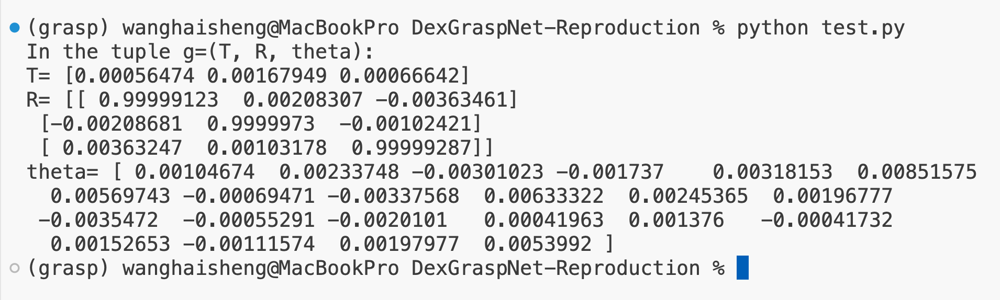

# ShadowHand Pose Optimization for Object Grasping

This code implements an optimization algorithm to simulate the grasping of an object by a robotic hand (ShadowHand) using a series of energy functions. The script combines kinematic constraints, object-surface contact points, and collision handling into an iterative optimization process that outputs an optimal hand configuration for grasping.

## Overview

The code defines multiple energy functions to evaluate different aspects of the hand-object interaction, such as contact stability, penetration, self-collision, and joint limits. The total energy is computed as a weighted sum of these individual energy components, and the optimization aims to minimize this total energy by adjusting the hand's position, rotation, and joint angles.

### Key Functions

1. **Rotation Matrix (`rotation_matrix(axis, theta)`)**: 
   Generates a rotation matrix for rotating around a given axis by a specified angle.

2. **Skew Symmetric Matrix (`skew_symmetric_matrix(x)`)**: 
   Creates a skew-symmetric matrix, which is essential for calculating cross-products in the context of rotational transformations.

3. **Contact Stability Energy (`compute_E_fc(contact_points)`)**: 
   Computes the energy related to the contact points between the hand and object surfaces, aiming for stable contact distribution.

4. **Contact Distance Energy (`compute_E_dis(contact_points, object_surface)`)**: 
   Measures the distance between contact points and the nearest point on the object surface, encouraging contact points to remain close to the object surface.

5. **Penetration Energy (`compute_E_pen(hand_surface_points, object_surface)`)**: 
   Calculates the penalty for hand points that penetrate the object surface by checking if distances fall below a threshold.

6. **Self-Collision Energy (`compute_E_s_pen(hand_surface_points)`)**: 
   Penalizes points on the hand surface that come too close to each other, thus avoiding self-collision.

7. **Joint Limits Energy (`compute_E_joints(theta, theta_min, theta_max)`)**: 
   Penalizes joint angles that exceed their specified minimum or maximum limits.

### Parameters and Weights

- **penetration_threshold**: Threshold distance for hand points penetrating the object surface.
- **self_collision_threshold**: Threshold distance to prevent self-collision of hand points.
- **w_dis, w_pen, w_s_pen, w_joints**: Weights for contact distance, penetration, self-collision, and joint limits energies, respectively.
- **learning_rate**: Step size for updating parameters during the optimization.
- **num_iterations**: Total iterations for the optimization loop.

### Initialization

- **Object Surface (`object_surface`)**: 100 random points on a unit sphere to simulate the object surface.
- **Hand Configuration**: Initial translation vector `T`, rotation matrix `R`, and joint angles `theta` (22 degrees of freedom for ShadowHand).
- **Contact Points (`contact_points`)**: Initial contact points for the hand on the object.
- **Hand Surface Points (`hand_surface_points`)**: Randomly initialized points on a unit sphere representing the hand's surface.

### Optimization Process

The script performs a gradient-based optimization with random gradients applied to the translation vector `T`, rotation matrix `R`, and joint angles `theta`. After each update:

- **Orthogonality of Rotation Matrix**: Ensured by applying Singular Value Decomposition (SVD) to maintain a valid rotation matrix.

The optimization loop runs for `num_iterations` iterations, minimizing the total energy `E_total` by adjusting `T`, `R`, and `theta`.

### Results

Upon completion, the optimized parameters `T`, `R`, and `theta` are printed, representing the hand's configuration that minimizes the total energy. These values define the final position, orientation, and joint angles of the hand for stable object grasping.

